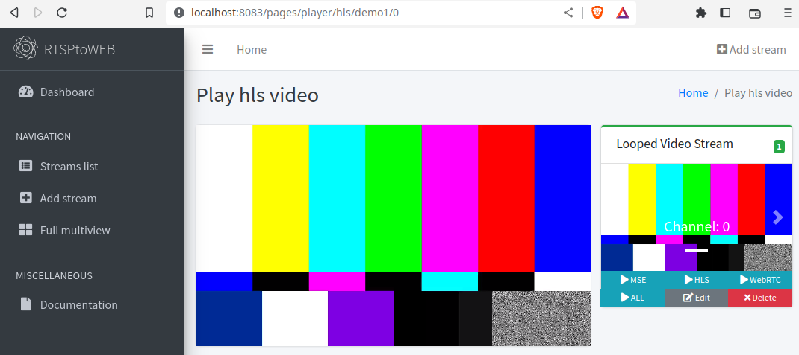

# RTSP Stream to Web Demo

This project uses a Docker-based setup to simulate an RTSP video stream and then makes this stream available through a web-based interface using RTSPtoWeb.



## Prerequisites

- Docker
- Docker Compose

## Getting Started

1. Clone this repository and navigate to the project directory.

```bash
git clone git@github.com:JAremko/rtsp-restream-demo.git
cd rtsp-restream-demo
```

2. Build and start the services.

```bash
docker-compose up --build -d
```

The RTSP stream server (rtspatt) and the RTSPtoWeb server are now running in the background.

- The rtspatt server is streaming a test pattern on `rtsp://localhost:8554/live.sdp`.
- The RTSPtoWeb server is making this stream available at `http://localhost:8083`.


## Stopping the Services

To stop the services, run the following command in the terminal:

```bash
docker-compose down
```

This will stop and remove the containers.

